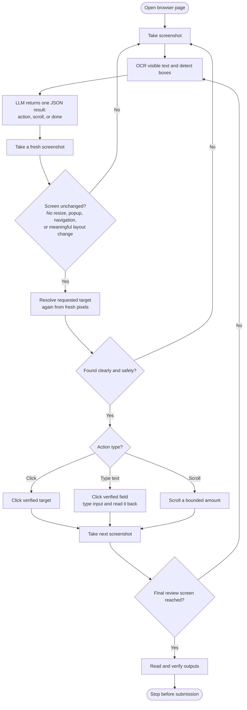

# Architecture

The implemented slice prepares a fictional member's statement request and stops at review. A standalone legacy-style application uses tables and an iframe. Automation has no access to its DOM, accessibility tree, or database. A browser adapter exposes screenshots and input; Tesseract identifies text while OpenCV and normalized spatial relationships resolve controls. Browser viewport and device scale are configurable, and every action is re-resolved from the latest screenshot.



Discovery starts with no action targets or steps. Gemini observes screenshots and OCR words, proposes a control locator and action, and receives feedback when pixels cannot resolve the proposal. No button catalog or screen-heading list is provided. After a click, the next observed heading becomes its verified checkpoint; typing generates an automatic field readback check. At completion the model supplies output locators. The compiler stores these learned targets and verified steps with input references. The statement input/output contract and known exception handlers remain reviewed configuration; discovery does not invent unobserved recovery behavior. Replay is a separate rule-driven engine with no provider client. Both paths share policy, input dispatch, observations, and checkpoints.

**Why a browser surface, not native desktop, for the implemented slice.** The local legacy-style web target gives a reproducible, isolated end-to-end environment while still exercising the important constraint: no DOM, accessibility-tree, or database access is used by automation. It also makes scenario injection, evidence collection, iframe/table-layout coverage, and CI feasible without requiring a particular Windows desktop application or elevated OS automation permissions. This is a scope choice, not a claim that browser automation is inherently preferable: for a real institution, an available API remains the preferred integration, and a native UI may be the only viable non-API surface.

# Artifact schema

Schema-v3 JSON artifacts contain learned target labels, normalized regions, directional label/control relationships, geometry hints measured from resolved pixels, confidence thresholds, and winner margins. Model proposals cannot lower executor confidence requirements. A draft has no replayable steps; final validation requires steps and all output bindings. Input verification and output extraction use one reader: resolve the current box, crop it, and OCR its contents. Field borders or printed-value ink can appear right, left, above, or below a label. Ambiguous matches stop instead of choosing the first. Mask prefixes may be normalized, but account digits are never inferred from inputs. Version-2 artifacts remain readable with their original hashes and right-of-label output semantics.

The following is the shape of a schema-v3 artifact; the real file also embeds the generated JSON Schemas for the typed inputs and outputs.

```json
{
  "schema_version": "3.0",
  "capability_id": "prepare_statement_request",
  "capability_version": "3.0.0",
  "description": "Prepare a statement request and stop at review.",
  "input_schema": { "member_id": "five-digit string", "statement_month": "2026-MM", "delivery_method": "postal | electronic" },
  "output_schema": { "masked_account": "****1234", "statement_month": "string", "delivery_method": "postal | electronic", "review_ready": true },
  "entry_condition": "Member Search",
  "targets": {
    "target_1": {
      "text": "Member ID",
      "kind": "field",
      "relationships": ["right_of", "same_row"],
      "region": [0.0, 0.0, 1.0, 1.0],
      "geometry_hint": [0.39, 0.22, 0.25, 0.055],
      "min_confidence": 0.5,
      "winner_margin": 0.1
    }
  },
  "steps": [
    {
      "id": "step_1",
      "action": "type_text",
      "target": "target_1",
      "input": "member_id",
      "pre": "Member Search",
      "post": { "kind": "field_input", "text": "Member Search", "target": "target_1", "input": "member_id" }
    }
  ],
  "extractions": {
    "masked_account": { "label": "Masked account", "parser": "masked_account", "target": { "text": "Masked account", "kind": "value", "relationships": ["right_of"] } }
  },
  "handlers": [{ "code": "MEMBER_NOT_FOUND", "text": "Member not found", "response": "business_outcome" }],
  "success_condition": "Statement Review",
  "provenance": { "source": "live_llm_discovery", "genuine_discovery": true }
}
```

Schema version identifies the artifact language; capability version identifies a particular workflow revision. A content hash pins the exact artifact used by a run. Unknown fields, malformed regions, missing references, unsupported contracts, and duplicate step identifiers fail validation. Artifacts cannot embed executable code. A fixture marked `authored_test_fixture` enables offline tests and is never labelled genuine discovery. A separate model-generated artifact is required for submission.

# Determinism & error handling

Replay follows declared actions and conditions, without LLM decisions. OCR uses exact normalized tokens, normalized search regions, relational candidate scoring, confidence thresholds, and a required margin over the runner-up. Field candidates combine contours, edges, whitespace/uniformity, geometry hints, and label relationships; borderless geometry is accepted only when uniquely supported and later verified. Foreground-layer detection runs before actions, and background OCR behind a modal is excluded. Timing and pixels can vary; determinism means explicit decisions and bounded behavior, not guaranteed success on arbitrary layouts.

Not-found, validation rejection, and permission denial are caller-visible business outcomes. Slowness is a bounded wait; a known notice has one permitted dismissal. Application errors stop with a structured failure. An unrecognized modal or unmet checkpoint pauses for intervention. The modal detector recognizes visual structure rather than enumerating the unknown dialog's text. No potentially irreversible action is blindly retried. Model 429/503 and transport failures apply only to discovery: at most three retries, bounded exponential backoff, and provider retry guidance where supplied. Exhaustion routes intervention or controlled failure. New observations invalidate stale proposals. Replay tests run without keys and fail if a provider decision method is called.

# Heterogeneity & multi-tenant

The seam is perception/input versus flow: the engine depends on a small surface contract for `start`, `observe`, `click`, `type_text`, `key`, `scroll`, liveness, dimensions, session identity, and close. A `DesktopSurface` adapter can implement that same contract with a window capture API and OS input backend, leaving the artifact, discovery loop, visual resolver, checkpoints, handlers, and replay engine unchanged. The adapter would add explicit process/window allowlisting, foreground-window ownership, coordinate conversion between capture pixels and physical display pixels, DPI/scale-change detection, window-identity checks after every activation, and safe focus recovery. A native accessibility provider could be added as an additional typed target strategy, but pixel grounding remains the common fallback for owner-drawn or inaccessible legacy controls. Neither desktop nor accessibility support is claimed as implemented.

For production reuse, separate immutable vendor/version capabilities from tenant profiles and runtime inputs. Profiles would override allowed visual assets, regions, entry points, and locales; overrides could not insert actions or broaden central policy. Effective permissions are the intersection of platform and tenant policy. Pin the merged artifact/profile hash and run compatibility checkpoints before invocation. Unknown vendor/version changes stop for reviewed revision rather than automatic model repair. Scale with isolated workers, tenant-scoped browser contexts and secrets, exclusive session leases, authorized operator routing, and tenant-specific evidence retention. These distributed components are deliberately design-only.

# Escalation & handoff

Lifecycle states distinguish `RUNNING`, `WAITING_FOR_MODEL`, `WAITING_FOR_HUMAN`, `HUMAN_CONTROL`, `VERIFYING_RESUME`, and `TERMINAL`. A local bearer-token-protected panel renders screenshots and forwards human commands to the exact existing page. Generation numbers reject stale control commands. A lock serializes ownership changes and dispatch; automation does not act during human control. Operator actions are logged with values redacted. On resume the system revokes human control, observes again, and requires the paused checkpoint with no blocking modal. An invalid resume returns control to the human. The panel intentionally offers limited, policy-checked control rather than unrestricted OS access.

Intervention timeout ends safely if no person responds. SQLite stores metadata and checkpoints but does not resurrect a destroyed browser. A browser crash returns `SESSION_LOST`; session restore inside the proxy is a manual operation within the existing browser context. Automated handoff tests exercise the actual protocol with simulated operator commands, distinct from evidence of a person operating the panel.

# Safety

Policy checks constrain exact origin/port/routes, action types, and operator keys. Optional allowed_targets restricts labels when configured; by default discovery can propose new visible labels. A configurable risky-action pattern rejects submit/delete/transfer/payment/approval labels, including during operator control. This pattern is conservative and is not a universal classifier of an action's effects. Browser routing independently blocks external requests, non-GET requests, and the demo's final submission route. LLM proposals receive schema, current-pixel, and policy validation and cannot modify those controls. Dynamic locators/checkpoints containing runtime input values, long digit sequences or email-like data are rejected before compilation.

Only synthetic local data is permitted for discovery. Screenshots sent to the model are not a production PII-redaction solution. Persistent screenshots are masked except for approved static UI words; logs use bounded structured fields and omit prompts, response bodies, and typed values. No credentials enter artifacts. Live screenshots are served locally to the authorized operator with no-store headers. Visual interpretation cannot provide universal protection against a maliciously redesigned page; application/version compatibility and deployment isolation would be necessary in production.

# Cuts

Implemented dynamic visual target and checkpoint discovery for the synthetic statement task. The business schemas, known error meanings and local deployment policy are still task-specific; this is not universal automation across arbitrary sites. A renamed-UI test checks that the compiler and replay have no dependency on the authored button catalog. Icon-only controls, arbitrary task schemas, production bank integration, real submission, cloud deployment, distributed tenancy, desktop adapter, automatic LLM replay fallback, and browser-crash recovery remain out of scope. Review the generated artifact before production reuse. A model-proposed rectangle without supporting field pixels is refused during discovery.

Next priorities would be empirical OCR robustness across fonts/DPI, a stronger target detector (current writable-area detection supports light outlined fields and rejects dark filled controls), safe tenant-profile specialization, and formal artifact approval. Submission readiness requires successful real model discovery and replay evidence; mocked provider tests cannot satisfy that gate. Current executed validation is summarized separately in `evidence/README.md` so design claims are not confused with test results.
